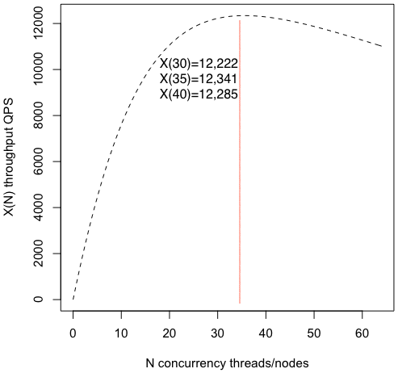

# [Web service scalability](https://go-talks.appspot.com/github.com/marselester/scalability/scalability.slide)

Scalability is constrained by contention and crosstalk.
The time when your system is unable to keep up with load might come unexpectedly 🚒.
Earlier you know your system's limits, better you're prepared to handle increasing load (optimize, redesign).
[This presentation](https://go-talks.appspot.com/github.com/marselester/scalability/scalability.slide)
provides an overview of how to measure and estimate web service's scalability.
It is inspired by Baron Schwartz's talk [Scalability is Quantifiable](https://www.xaprb.com/slides/lisa17-quantifying-scalability-universal-scalability-law/).

Run `present` to view the slides with notes:

```sh
$ git clone https://github.com/marselester/scalability.git
$ cd ./scalability/
$ go run golang.org/x/tools/cmd/present -notes
```

## Universal scalability law

Forecast how concurrency N (nodes count) affects throughput X (requests per second).
The example is taken from
[Practical Scalability Analysis with the Universal Scalability Law](https://www.vividcortex.com/resources/universal-scalability-law/) book.

You can paste `usl.r` content in R interactive session or execute commands with `source`:

```sh
$ brew install r
$ r
> source("usl.r")
> lambda
  lambda
995.6486
> sigma
     sigma
0.02671591
> kappa
       kappa
0.0007690945
```

The system's throughput will increase up to 35 nodes:
```
N = sqrt((1-σ) / κ) = sqrt((1 - 0.02671591) / 0.0007690945) = 35
```

Peak throughput will be 12,341 requests per second:
```
X(N) = (λ * N) / (1 + σ * (N-1) + κ * N * (N-1)) =
(995.6486 * 35) / (1 + 0.02671591 * 34 + 0.0007690945 * 35 * 34) = 12341
```


